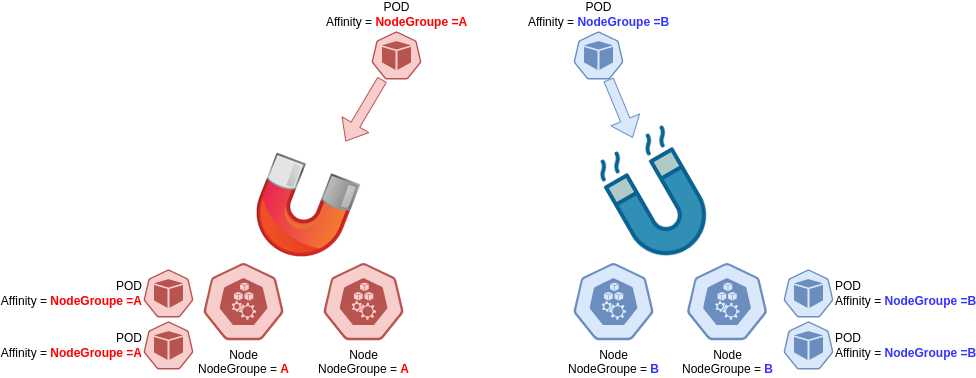

# \[Concepts] - Affinity/NodeGroupe et Taints/Tolerations

## Description

Les PODs doivent êtres démarrés sur des Nodes afin de disposer de ressources (CPU/Me-moire/Stockage/réseau)

Il est possible de configurer les nodes et les PODs avec des éléments spécifiques K8S afin d'organiser le cluster et de spécifier sur quel Nodes des PODs vont s’exécuter

Pour cela, K8S utilise les elements suivants :

### NodeGroupe

Ce type d’élément permet d'identifier des worker nodes dans le cluster en les estampillant avec une étiquette particulière.

Les workers nodes disposent d'un **label** qui indique à quel NodeGroupe ils appartiennent

### Affinity

Ce type d’élément permet d'indiquer, dans la définition d'un POD, sur quel Node le POD doit s’exécuter.La valeur de l’élément Affinity doit correspondre à des valeurs de NodeGroupe présent dans le cluster

### Taints

Ce type d’élément est configuré sur les Nodes et indiquent toutes les règles qui empêche un POD de s’exécuter sur ce Node

Il est construit de 3 champs :&#x20;

* **Key** : La Clé spécifie par l’administrateur
* **Value** : la Valeurs spécifie par l'administrateur
* **Effect**: Indique l'effet déclenché par cette règle parmi :&#x20;
  * **PreferNoSchedule** : <mark style="color:red;">**Préférence**</mark> pour ne pas prévoir le démarrage du POD sur ce Node
  * **NoSchedule** : <mark style="color:red;">**Obligation**</mark> de ne pas prévoir le démarrage du POD sur ce Node
  * **NoExecute** : <mark style="color:red;">**Obligation**</mark> de ne pas exécuter le POD sur ce Node

### Tolerations

Ce type d’élément est configuré dans la définition du POD et permet de "**tolérer**" certaines règles **Taints** qui interdisent l’exécution des PODs sur des Nodes.

Les tolerations définis dans le POD seront t<mark style="color:red;">**outes les règles Taints qui seront ignorées**</mark> lors du choix de démarrage du POD sur un Node


## Fonctionnement

### Affinity/NodeGroupe

Ces éléments permettent de regrouper des PODs avec des Nodes (= <mark style="color:red;">**aimant attirant**</mark>)

Le cluster va chercher à exécuter les PODs avec ces Affinity sur les Nodes appartenant au NodeGroupe correspondant



### Taints/Tolerations

Ces éléments permettent de repousser des PODs et des Nodes (= <mark style="color:blue;">**aimant repoussant**</mark>)

Lors de la demande d’exécution d'un POD, pour chaque node, le cluster va faire la <mark style="color:red;">**soustraction**</mark> des Taints et des Tolerations entre le Node et le POD

Le résultat restant lui permettra de prendre une décision concernant l’exécution du POD sur ce Node


## Exemple

### NodeGroupe

Lorsque nous créons un NodeGroupe dans le cluster, les workers nodes qui sont démarrés dans ce NodeGroupe se retrouvent avec le label spécifique (exemple ici chez AWS pour le node groupe : **common-spot**)

```
eks.amazonaws.com/nodegroup=common-spot
```

### Affinity

Exemple de définition d'affinity dans un POD

```
spec:
  affinity:
    nodeAffinity:
      requiredDuringSchedulingIgnoredDuringExecution:
        nodeSelectorTerms:
        - matchExpressions:
          - key: eks.amazonaws.com/nodegroup
            operator: In
            values:
            - common-spot
      preferredDuringSchedulingIgnoredDuringExecution:
      - weight: 10
        preference:
          matchExpressions:
          - key: another-node-label-key-high
            operator: In
            values:
            - another-node-label-value-high
      - weight: 1
        preference:
          matchExpressions:
          - key: another-node-label-key
            operator: In
            values:
            - another-node-label-value
```

Dans cet exemple nous avons :&#x20;

* <mark style="color:blue;">**requiredDuringSchedulingIgnoredDuringExecution**</mark> : <mark style="color:red;">**Oblige**</mark> le POD a s’exécuter sur un node avec le label <mark style="color:red;">**eks.amazonaws.com/nodegroup = common-spot**</mark>
* <mark style="color:blue;">**preferredDuringSchedulingIgnoredDuringExecution**</mark> : <mark style="color:red;">**Préférence**</mark> pour que le POD s’exécute :&#x20;
  * En priorité (poids de 10) sur les Nodes avec le label **another-node-label-key-high = another-node-label-value-high**
  * Si pas possible, en seconde priorité (poids 1) sur les Nodes avec le label **another-node-label-key = another-node-label-value**


Il s'agit de <mark style="color:blue;">**preferredDuringSchedulingIgnoredDuringExecution,**</mark> donc si aucun node ne correspond à ces demandes, le POD sera executé sur n'importe quel autre POD qui respecte seulement la demande <mark style="color:blue;">**requiredDuringSchedulingIgnoredDuringExecution**</mark>&#x20;


### Taints

Voici comment configurer une Taint sur un worker node

```
kubectl taint nodes node1 key1=value1:NoSchedule-
```

### Toleration

Voici comment définir une Toleration dans la définition d'un POD

```
tolerations:
- key: "key1"
  operator: "Equal"
  value: "value1"
  effect: "NoSchedule"
```

## Sources




