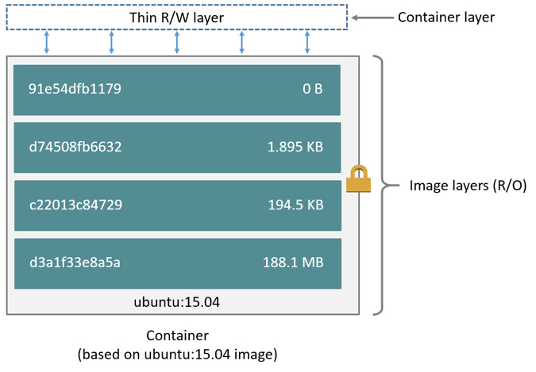

# \[Concepts - Docker] - Gestion des "layers"

## Description

Chaque construction d'image Docker repose sur un empilement de "couches" appelées "**layers**"

Les layers représentent des modifications par rapport à l’état précédent et permet de partager des layers entre différentes images docker pour économiser de l’espace disque et accélérer les déploiement (système de cache)

## Fonctionnement

Chaque layers s'appuie sur les éléments fournis par la layer précédente et rajoute ses modifications

La somme de la layer précédente et des différences apportées par la layer courante est exposée à la layer supérieur

Il est possible que la layer suivante soir le POD

### Driver overlay2

Pour gérer ce système, Docker utiliser les drivers overlay

Ce système repose sur des dossiers dans **/var/lib/docker/overlay2** qui représentent chacun une layer

Dans chacun des dossier nous avons :&#x20;

* **link** : Fichier contenant l'identifiant de la layer "0"&#x20;
* **lower**: Fichier contenant la liste des layers précédentes
* **diff:** Dossiers contenant les éléments du file system modifiés par la layer &#x20;

## Exemple

Je viens de trouver la cause de la consommation consquente du stockage locale des PODs airflow

Sur le Node on-d nous constatons que l'utilisation maximum du stockage est bien realisé sur le disque de l'EC2 dans le file systeme racine /

\`\`\`

\[root@ip-10-1-9-168 /]# df -h\
Filesystem Size Used Avail Use% Mounted on\
devtmpfs 7.8G 0 7.8G 0% /dev\
tmpfs 7.8G 0 7.8G 0% /dev/shm\
tmpfs 7.8G 3.0M 7.8G 1% /run\
tmpfs 7.8G 0 7.8G 0% /sys/fs/cgroup\
/dev/nvme0n1p1 30G 16G 15G 52% /

\`\`\`

La plus grande consommation d'espace se situe dans : **/var/lib/docker/overlay2**

\`\`\`

\[root@ip-10-1-9-168 /]# du -a / | sort -r -n | head -n 20\
31062820 /\
29278424 /var\
28825336 /var/lib\
21139940 /var/lib/docker\
21084260 /var/lib/docker/overlay2\
7655016 /var/lib/kubelet\
7038008 /var/lib/kubelet/pods\
1964196 /var/lib/docker/overlay2/5f314b630e7439fbcd6517e6bb8c52020976e6b6979118065edc67784ebe551c\
1821452 /var/lib/docker/overlay2/b6ac1f4b4fc0c2e200e50cea354ec756a63441cb392a41f757f110fcb5d28ded\
1697004 /var/lib/docker/overlay2/b6ac1f4b4fc0c2e200e50cea354ec756a63441cb392a41f757f110fcb5d28ded/merged\
1529708 /usr\
1465480 /var/lib/docker/overlay2/5f314b630e7439fbcd6517e6bb8c52020976e6b6979118065edc67784ebe551c/merged\
1427544 /var/lib/docker/overlay2/b6ac1f4b4fc0c2e200e50cea354ec756a63441cb392a41f757f110fcb5d28ded/merged/usr\
1021516 /var/lib/docker/overlay2/0d612ea283dea5e1006464921a947e0025022169992c493948430575f31fa921\
994140 /var/lib/docker/overlay2/0d612ea283dea5e1006464921a947e0025022169992c493948430575f31fa921/merged\
978988 /var/lib/docker/overlay2/d3b1d6bcf06439889e60b76c0676ac1df2b65e1b06ee0ed664ad94093c64bc7c\
978980 /var/lib/docker/overlay2/d3b1d6bcf06439889e60b76c0676ac1df2b65e1b06ee0ed664ad94093c64bc7c/diff/srv/gitlab\
978980 /var/lib/docker/overlay2/d3b1d6bcf06439889e60b76c0676ac1df2b65e1b06ee0ed664ad94093c64bc7c/diff/srv\
978980 /var/lib/docker/overlay2/d3b1d6bcf06439889e60b76c0676ac1df2b65e1b06ee0ed664ad94093c64bc7c/diff\
966892 /var/lib/docker/overlay2/22fa7fa0d46b6827735e2a8e15827bbca912825a700c2bfccb0e3d9ad8641f79

&#x20;

\`\`\`

CEt espace est utilisé par docker pour les files systems des POD (decrit ici : https://docs.docker.com/storage/storagedriver/overlayfs-driver/#how-the-overlay2-driver-works)

Comme decrit dans cet article, le **overlay2** fonctionne avec :

* sur la couche 0:  le folder "diff" qui contient le file systeme de l'image source / le fichier "link" qui contient nom de la couche 0
* sur chacune couche supplementaire : le fichier "lower" qui fait reference à la couche parente (utilisant les ID) /  folder "diff" pour les elements de différence par rapport à la couche perente /  folder "merged" qui contient la somme de l'image parente et des diff de la couche courante, qui sera presenté à la couche supperieur (ou au POD dans le cas de la derniere couche)

&#x20;

Grace à cet article nous pouvons identifier les POD qui utilisent les couches de l'overlay2 : [https://fabianlee.org/2021/04/08/docker-determining-container-responsible-for-largest-overlay-directories/](https://fabianlee.org/2021/04/08/docker-determining-container-responsible-for-largest-overlay-directories/)

Apres analyse sur le node on-d qui consomme beaucoup de stockage local, nous obtenons ceci :

&#x20;

/k8s\_**airflow-scheduler\_airflow-scheduler-7ff8469c5c-zk9j6\_scheduler**\_9b503a02-297f-4222-a64a-8aac382937fc\_0 /var/lib/docker/overlay2/**5f314b630e7439fbcd6517e6bb8c52020976e6b6979118065edc67784ebe551c**/merged /k8s\_**superset\_superset-worker-6976b99c66-fnlql\_superset**\_6755e71d-630d-4eab-9a0b-e1016b00aeb9\_0 /var/lib/docker/overlay2/**b6ac1f4b4fc0c2e200e50cea354ec756a63441cb392a41f757f110fcb5d28ded/**merged 1--Cas du **airflow-scheduler\_airflow-scheduler:**Dans le dossier nous pouvons voir les différentes couches liées (dans le fichier "lower") :l/KY24DBJIZIQGFJXLL3XZCWCV4G:l/XKPSXC34XNPZRVDPU42CO6QPBJ:l/KEFKXNLQW4RBWMNU5GIC4X4VEY:l/EPI5TB4QYBME6R2GV2747OWDD5:l/NJKSSLNKVQZKFXV4UTZRL4K3AY:l/6GYKUUFZBTHRRUCY7AH556CNFU:l/FHU25RLHKUSLNN7ONM63K4PWT2:l/R6IUOEXC6QDOAQX4WNAAQ5ELQE:l/QRYBKWGTPNN7GALSVB7GO5FHWK:l/AIMBBC4N6AVSBCOSDDY2M4FHWG:l/B33EGPZGYQUY2AGVYZBJTSMBMY:l/TG7LUDSU5J3OHELNCXQ3OQSWA5:l/MDEP2THVCSICJ5UQU2ASHJ3SLB:l/47GLODSMRKCZOKK56SOE7IXWGY Dans le dossier "diff" nous pouvons voir les modification realisées dans cette couche\`\`\`ll ./diff/\
total 0\
drwxr-xr-x 3 root root 21 Jan 18 01:16 opt\
drwxr-xr-x 4 root root 33 May 11 13:50 run\
drwxr-xr-x 3 root root 21 May 9 14:14 var\`\`\` Comme cette couche est associé au POD c'est donc ces dossiers qui sont utilisées pour lire/ecrire par le POD 2--Cas du**superset\_superset-worker-6976b99c66-fnlql\_superset:**Dans le dossier nous pouvons voir les différentes couches liées (dans le fichier "lower") :l/CYIJJD4YPKXM4V7MNJQOMWDWT4:l/FPZUQ6PP3XWEPJFWP3WC77DWUC:l/6PWLZUGQCFFUVQGQMCQU2WI42X:l/AIK7XS3TTSVQJZKQILD3LRTPF6:l/O5P4HHPSK4FA3EQ6HK26ZV5N46:l/7RD2QTFERU5CT3TYLGPU7NQQUR:l/ASABS6DRV2L7C5V5I4LYMXQNXG:l/X7QCMNCBTSWAEB7ZGHYYXKHZNZ:l/ZPHIA6QBBHT2MOT5FNEXMMN3CF:l/XPFDW3PTL77ORTOO7GA777TYT7:l/WXG7UC4ISWEC4WDPTXS37UJRH5:l/2Q5U3ONJS5PGX6ECHBP7YEOYKM:l/HJQPFQXMPNLW4PWCQQ7WVEO7PS:l/VGL7ZDEDAJWE3LNF5T2ZU2PRSZ:l/EFRCV4M7TM52O5LVRQ7LMDHPQB:l/KA6VLP2OOU7F62SAYG2ST7JDLW:l/IJQSZXMIEVHPY6CFUT45ROVBA3:l/RCT4CQ2AWMRLXT7YNZZN6WSX6K:l/GVABWSOEAZQS32ZV5MLVPQPOSI:l/ENUVLZHYUHT6Z2RCGLWRKGVNUA\[Dans le dossier "diff" nous pouvons voir les modification realisées dans cette couche\`\`\`ls -la ./diff/\
total 0\
drwxr-xr-x 3 root root 22 May 10 14:36 app\
drwx------ 3 root root 20 May 10 14:36 root\
drwxr-xr-x 3 root root 21 May 10 17:22 run\
drwxrwxrwt 3 root root 27 May 10 17:23 tmp\
drwxr-xr-x 3 root root 19 Feb 28 00:00 usr\`\`\`Comme cette couche est associé au POD c'est donc ces dossiers qui sont utilisées pour lire/ecrire par le POD Comme indiqué dans la documentation ([https://docs.docker.com/storage/storagedriver/overlayfs-driver/#how-container-reads-and-writes-work-with-overlay-or-overlay2)](https://docs.docker.com/storage/storagedriver/overlayfs-driver/#how-container-reads-and-writes-work-with-overlay-or-overlay2\)) chaque modification d'un fichier present dans une couche inferieur (modification / supression) se traduit par des operations qui rajoutent des données dans la couche docker utilisé par le POD Conclusion Dans le cas de  **airflow-scheduler\_airflow-scheduler**  nous pouvons constaté dans la couche  **5f314b630e7439fbcd6517e6bb8c52020976e6b6979118065edc67784ebe551c**  que les données sont rajoutés régulièrement dans **/diff/opt/airflow/logs/scheduler**\`\`\`root@ip-10-1-9-168 scheduler]# pwd\
/var/lib/docker/overlay2/5f314b630e7439fbcd6517e6bb8c52020976e6b6979118065edc67784ebe551c/diff/opt/airflow/logs/scheduler\
\[root@ip-10-1-9-168 scheduler]# ll\
total 0\
drwxrwxr-x 7 50000 root 78 May 9 14:14 2022-05-09\
drwxrwxr-x 7 50000 root 78 May 10 00:00 2022-05-10\
drwxrwxr-x 7 50000 root 78 May 11 00:00 2022-05-11\
lrwxrwxrwx 1 50000 root 38 May 11 00:00 latest -> /opt/airflow/logs/scheduler/2022-05-11\`\`\` Il faut donc modifier le Helm pour passer ces logs de scheduleur egalement sur S3 afin de ne plus utiliser les couches Docker pour stocker celaEn attendant cela, il peut etre interessant de prevoir un redemarrage regulier du POD pour purger ces couches Docker En cas de surconsommation d'espace qui apparaitrait de nouveau, le redemarrage des POD scheduleur peut suffir a liberer de l'espace car il est géré par un deployment (les logs seront perdues)

## Sources
