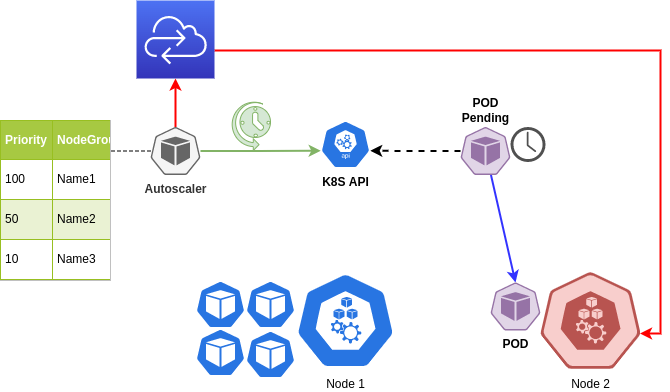
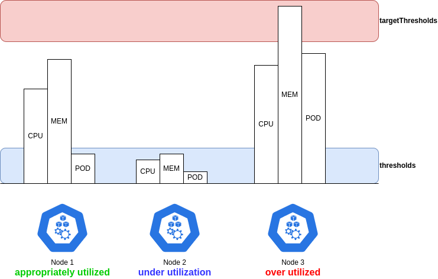

# \[Concepts] - Scale UP, Scale DOWN and Manage Scheduling

## Description

Un cluster K8S dispose d'un nombre de ressources (CPU / Mémoire) équivalente à <mark style="color:red;">la somme des ressources de tous les Workers Nodes</mark> pressent dans le cluster.

Par défaut le cluster K8S ne sait pas automatiquement ajouter/supprimer des worker nodes pour gérer de manière optimisé les ressources nécessaires au fonctionnement


Si des <mark style="color:blue;">ressources sont manquantes</mark>, les nouveaux PODs resteront en **pending** tant qu'un administrateur ne rajoute pas de ressources dans le cluster (nouveau worker node ou suppressions d'autres POD pour libérer de la ressource)



Si un cluster est <mark style="color:blue;">sous utilisé</mark>, K8S ne va pas éteindre un worker node qui n'utilise pas ses ressources, celui-ci va resté actif et non utilisé


Pour palier ce manque, il existe 2 projets :

* **Cluster-Autoscaler** : Gestion de l'ajout/suppression de workers nodes ([https://github.com/kubernetes/autoscaler](https://github.com/kubernetes/autoscaler))
* **Descheduleur** : Déplacement des PODs dans un cluster pour optimiser l'utilisation des ressources et le fonctionnement du projet Autoscaler

## Fonctionnement

### Autoscaler

Ce projet repose sur des PODs déployés dans le cluster K8S qui va faire l'interface entre le cluster et l'API du provider d'infrastructure (AWS, GCP, OPK, etc...)

Le POD de l'autoscaler va vérifier de manière régulière l’état du cluster (le temps entre chaque versification est paramétrable) et réaliser les appels API sur le provider d'infrastructure en fonction de l’état du cluster et de sa configuration

#### Scale UP

Lorsque le cluster est en manque de ressource, les nouveaux PODs restent en Pending

Lors de la vérification périodique de l'autoscaler, si des PODs sont en Pending, il va faire appel à l'API du Provider pour démarrer une nouvelle machine qui deviendra un nouveau worker node

Vous devez indiquer dans la configuration le(s) nom(s) du (des) NodesGroupes à utiliser dans le cluster pour que l'autoscaler réalise le bon appel API


Si vous avez plusieurs NodesGroupes vous pouvez mettre en place des priorités : [https://github.com/kubernetes/autoscaler/blob/master/cluster-autoscaler/expander/priority/readme.md](https://github.com/kubernetes/autoscaler/blob/master/cluster-autoscaler/expander/priority/readme.md)


#### Scale DOWN

Lorsque le cluster dispose de worker node qui ne sont plus utilisés par des PODs "applicatifs" (sans prise en compte des DeamonSet) l'autoscaler va prévoir une extinction du worker node

Lors de la vérification périodique de l'autoscaler, si des workers nodes sont inutilisés, il va prévoir la suppression des ceux-ci.

### Descheduleur

Ce projet permet de reorganiser les PODs d'un cluster sur les nodes apres leurs demarrage en fonction de certaines regles ([https://github.com/kubernetes-sigs/descheduler#policy-and-strategies](https://github.com/kubernetes-sigs/descheduler#policy-and-strategies))

Il a pour objectif d'optimiser l'utilisation des ressources

#### Low Node utilization ([https://github.com/kubernetes-sigs/descheduler#lownodeutilization](https://github.com/kubernetes-sigs/descheduler#lownodeutilization))

Cette règle permet de déplacer les PODs d'un node A vers un node B dans le cas le node B dispose d'assez de ressource pour récupérer la charge du node A.

La règle prend comme paramètre les valeurs de ressources du node (CPU/Memoire/POD) que nous ne souhaitons pas dépasser (**targetThresholds**) et les valeurs considérées comme "sous utilisation" du node (**thresholds**)

* Si notre Node dispose de <mark style="color:red;">**TOUTES**</mark> les ressources en <mark style="color:red;">**dessous**</mark> du seuil **thresholds** les PODS de ce Node vont être redémarrés (evicts) pour qu'ils soient redéployés sur un autre Node
* Si notre Node dispose <mark style="color:red;">**d'AU MOINS UNE**</mark> ressource en <mark style="color:red;">**dessus**</mark> du seuil **targetThresholds** les PODS de ce Node vont être redémarrés (evicts) pour qu'ils soient redéployés sur un autre Node

#### Remove POD Violation Node affinity/taint ([https://github.com/kubernetes-sigs/descheduler#removepodsviolatingnodeaffinity](https://github.com/kubernetes-sigs/descheduler#removepodsviolatingnodeaffinity) / [https://github.com/kubernetes-sigs/descheduler#removepodsviolatingnodetaints](https://github.com/kubernetes-sigs/descheduler#removepodsviolatingnodetaints))

Ces règles permettent de vérifier régulièrement sur le cluster si les déploiement **passées** sont toujours cohérent avec les affinity de Nodes et les Taints entre les POD et les Nodes

* Si un Node a perdue un <mark style="color:purple;">label X</mark> après le déploiement de POD : La règle **RemovePodsViolatingNodeAffinity** permet de redéployer les PODs présent sur ce node qui ont besoin de fonctionner sur un Node avec le <mark style="color:purple;">label X</mark>
* Si un Node a perdue une <mark style="color:blue;">Taint Y</mark> après le déploiement de POD : La règle **RemovePodsViolatingNodeTaints** permet de redéployer les PODs présent sur ce node qui ont besoin de fonctionner sur un Node avec une <mark style="color:blue;">Taint Y</mark>

## Sources




