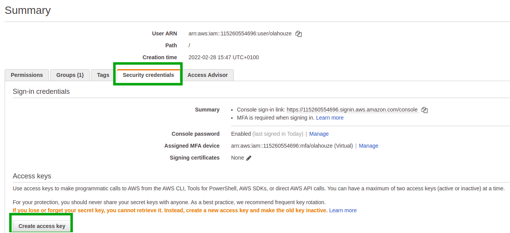

# \[Concepts] - Stockage

Le système K8S est construit pour être le plus agnostique de l’écosystème sous-jacent. La gestion du stockage répond donc à cette architecture grâces aux [PersistenntVolumes (PV)](vision-and-values.md#persistent-volume-pv), [PersistentVolumesClaim (PVC)](vision-and-values.md#persistent-volume-claim-pvc) et [StorageClass](vision-and-values.md#storage-class)

## Définitions :

### **Persistent Volume (PV) :**&#x20;

**Définition** :[https://kubernetes.io/fr/docs/concepts/storage/persistent-volumes/](https://kubernetes.io/fr/docs/concepts/storage/persistent-volumes/)

Un PV est un espace de stockage de donnée manipulable dans un cluster K8S. Il permet de proposer une quantité définie d'espace de stockage que les PODs pouront utiliser.

### **Persistent Volume Claim (PVC) :**&#x20;

**Définition** : [https://kubernetes.io/docs/concepts/storage/persistent-volumes/#persistentvolumeclaims](https://kubernetes.io/docs/concepts/storage/persistent-volumes/#persistentvolumeclaims)

Un PVC est un objet K8S qui peut être appelé par un POD pour demander de l'espace sur un PV

### **Storage Class :**&#x20;

**Définition** : [https://kubernetes.io/docs/concepts/storage/storage-classes/](https://kubernetes.io/docs/concepts/storage/storage-classes/)

Une Storage Classe représente les spécificités d'un média qui va supporter les PV. et permettre d'offrir différentes performances utilisable par les PVC


## Fonctionnement

Il existe 2 méthodes pour utiliser ces objets

* **Static Provisioning** : Les PV doivent  êtres créés manuellement par les OPS pour être utilisables par les PVC
* **Dynamic Provisioning** : Les PV sont automatiquement générés lors de l'appel d'un PVC en utilisant une Storage Classe




## Exemples

### Persistent Volume

Voici la définition d'un PV sur du stockage locale (type = **local**) appartenant à la Storage Classe "**manual**"

<details>

<summary>PV stockage local</summary>

```
apiVersion: v1
kind: PersistentVolume
metadata:
  name: task-pv-volume
  labels:
    type: local
spec:
  storageClassName: manual
  capacity:
    storage: 10Gi
  accessModes:
    - ReadWriteOnce
  hostPath:
    path: "/mnt/data"
```

</details>

### Storage Classe

Voici la définition d'une Storage Classe sur du stockage AWS  service EBS (type = io1) : [https://kubernetes.io/docs/concepts/storage/storage-classes/#aws-ebs](https://kubernetes.io/docs/concepts/storage/storage-classes/#aws-ebs)

<details>

<summary>Storage Classe AWS EBS</summary>

```
apiVersion: storage.k8s.io/v1
kind: StorageClass
metadata:
  name: aws-ebs
provisioner: kubernetes.io/aws-ebs
parameters:
  type: io1
  iopsPerGB: "10"
  fsType: ext4
```

</details>

### Persistent Volume Claim

#### Static provisioning

Voici la définition d'un PVC qui demande un PV correspondant à celui créé précédemment [ici](vision-and-values.md#persistent-volume). Comme nous utilisons la storageClassName = manual, le cluster va automatiquement associé ce PVC sur le PV répondant à ce besoin

<details>

<summary>PVC static provisioning</summary>

```
apiVersion: v1
kind: PersistentVolumeClaim
metadata:
  name: task-pv-claim
spec:
  storageClassName: manual
  accessModes:
    - ReadWriteOnce
  resources:
    requests:
      storage: 3Gi
```

</details>

#### **Dynamic Provisioning**&#x20;

Voici la définition d'un PVC qui va utiliser une Storage Classe permettant de générer à la demande les PV (ici sur AWS). Dans ce cas le driver utilisé dans la storage classe va s'occuper de demander à l'API AWS de créer les volumes adéquats et générer le PV

<details>

<summary>PVC Dynamic Provisioning</summary>

```
apiVersion: v1
kind: PersistentVolumeClaim
metadata:
  name: task-pv-claim
spec:
  storageClassName: aws-ebs
  accessModes:
    - ReadWriteOnce
  resources:
    requests:
      storage: 3Gi
```

</details>
